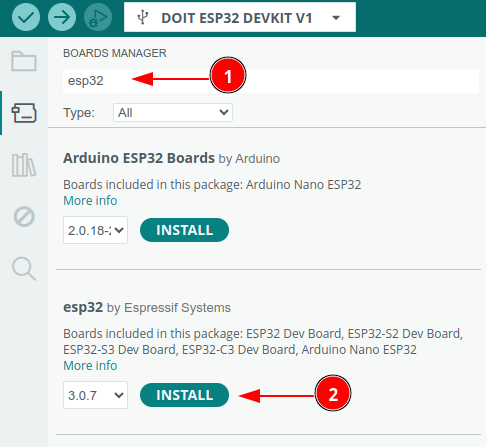

# Tutorial ESP32 DOIT Devkit V1 30 Pin

.png)

Tutorial ini akan memandu Anda dalam memulai penggunaan board ESP32 DOIT Devkit V1 dengan 30 pin. ESP32 adalah mikrokontroler dengan fitur Wi-Fi dan Bluetooth yang sangat populer untuk proyek IoT (Internet of Things). Devkit V1 adalah salah satu board pengembangan yang umum digunakan karena kemudahan penggunaan dan harganya yang terjangkau. Versi 30 pin mengacu pada jumlah pin input/output (GPIO) yang tersedia pada board.

Apa yang akan Anda pelajari:

- Pengenalan ESP32 dan DOIT Devkit V1: Memahami spesifikasi hardware, fitur, dan layout pin pada board.
- Instalasi Lingkungan Pengembangan: Mengunduh dan menginstal perangkat lunak yang dibutuhkan, seperti Arduino IDE dengan dukungan ESP32 atau platform pengembangan lainnya.
- Konfigurasi Board di Arduino IDE: Menambahkan dukungan board ESP32 ke Arduino IDE dan memilih board yang sesuai.
Memprogram LED Onboard: Memulai dengan program sederhana untuk mengendalikan LED yang terpasang pada board.
- **Memprogram LED Onboard:** Memulai dengan program sederhana untuk mengendalikan LED yang terpasang pada board.


## Pengenalan ESP32

**Spesifikasi Utama ESP32 DOIT Devkit V1 30 Pin:**

- **Mikrokontroler:** ESP32 dengan dual-core 32-bit
- **Kecepatan Clock:** Hingga 240 MHz
- **Memori RAM:** 512 KB
- **Memori Flash:** 4 MB (dapat bervariasi hingga 16MB tergantung versi)
- **Wi-Fi:** 802.11 b/g/n
- **Bluetooth:** Bluetooth Classic dan BLE 4.2
- **GPIO:** 30 pin (termasuk pin analog, digital, dan fungsi khusus)
- **Periferal:** ADC, DAC, PWM, UART, SPI, I2C, I2S, CAN
- **Tombol:** Tombol Reset dan Boot
- **LED:** LED biru onboard (terhubung ke GPIO2) dan LED merah (indikator daya)
- **USB to UART Bridge:** CP2102


## Instalasi Lingkungan Pengembangan

Sebelum kita dapat mulai memprogram ESP32 DOIT Devkit V1, kita perlu menyiapkan lingkungan pengembangan di komputer kita. Lingkungan pengembangan ini terdiri dari perangkat lunak (software) yang memungkinkan kita menulis, mengkompilasi, dan mengunggah kode ke board ESP32.

Ada beberapa pilihan platform pengembangan yang dapat digunakan untuk ESP32, tetapi yang paling populer dan mudah digunakan, terutama bagi pemula, adalah Arduino IDE (Integrated Development Environment). Arduino IDE adalah aplikasi lintas platform (dapat digunakan di Windows, macOS, dan Linux) yang menyediakan editor kode, compiler, dan alat untuk mengunggah program ke berbagai board mikrokontroler, termasuk ESP32.

Selain Arduino IDE, terdapat juga platform pengembangan lain seperti ESP-IDF (Espressif IoT Development Framework) yang lebih powerful dan fleksibel, tetapi membutuhkan pengetahuan yang lebih mendalam tentang pemrograman embedded dan konfigurasi yang lebih kompleks. Untuk tutorial ini, kita akan fokus pada penggunaan Arduino IDE karena kemudahan dan komunitasnya yang besar. Dalam bagian ini, kita akan membahas langkah-langkah detail

### 1. Instal Arduino IDE

Jika belum, unduh dan instal Arduino IDE dari situs resmi Arduino di https://www.arduino.cc/en/software. disarankan menggunakan arduino ide versi 2

### 2. Tambahkan URL Board ESP32

1. Buka Arduino IDE.
2. Pergi ke **File** > **Preferences**.
3. Klik Additional Board manager
 
5. Di bagian "Additional Board Manager URLs", tambahkan URL berikut: ``` https://dl.espressif.com/dl/package_esp32_index.json```
6. Jika sudah ada URL lain, pisahkan dengan koma.


### 3. Install Board ESP32

1. Buka **Tools** > **Board** > **Boards Manager**.


2. Cari "ESP32" di kolom pencarian.

3. Temukan "esp32 by Espressif Systems" dan klik **Install**.


### 4. Pilih Board ESP32

Setelah instalasi selesai, pergi ke **Tools** > **Board**.
- Pilih model board ESP32 yang sesuai yaitu **DOIT ESP32 Devkit V1**.


### 5. Pilih Port

- Sambungkan ESP32 ke komputer melalui kabel USB.
- Pergi ke **Tools** > **Port** dan pilih port yang terhubung dengan ESP32.

### 6.  Contoh Program Serial

Board **ESP32** mendukung komunikasi serial melalui koneksi USB yang memungkinkan pengiriman dan penerimaan data antara mikrokontroler dan komputer. Program berikut memanfaatkan fitur komunikasi serial untuk memberikan informasi status LED (ON/OFF) secara real-time ke *Serial Monitor*.

### Fitur Program:

1. Mengontrol LED internal pada **GPIO 2** untuk menyala dan mati secara bergantian.
2. Mengirimkan status LED ("ON" atau "OFF") ke *Serial Monitor* pada kecepatan komunikasi 9600 baud.

Berikut adalah kode lengkapnya:

```c++
#include <Arduino.h>
int led = 2;

void setup() {
  // initialize digital pin led as an output
  pinMode(led, OUTPUT);
  Serial.begin(9600);
}

void loop() {
  digitalWrite(led, LOW);    // turn the LED on
  delay(100);               // wait for a second
  Serial.println("OFF");
  digitalWrite(led, HIGH);   // turn the LED off
  delay(1000);               // wait for a second
  Serial.println("ON");
}
```

## Upload program

Bila tampilan seperti ini maka anda harus mengkonfigurasi ESP32 anda agar bisa kemode bootloader untuk melakukan upload program

```
- ---esptool.py v3.0-dev
- ---Serial port COM…
- ---Connecting........_____....._____.....__
```

Langkah yang harus dilakukan

- Tekan dan tahan tombol Boot/0
- Klik(tekan dan lepas) tombol reset/EN sambil tetap tekan tombol Boot .
- Lepas tombol boot
- Klik tombol upload pada Arduino IDE, bila sukses akan menampilkan info

```
- ---Compressed 261792 bytes to 122378...
- ---Writing at 0x00010000... (12 %)
- ---Writing at 0x00014000... (25 %)
- ---Writing at 0x00018000... (37 %)
```

- Setelah selesai Wajib klik tombol **reset** sekali lagi untuk berpindah dari mode bootloader menjadi mode run

Note

INGAT YA WAJIB Di Klik Tombol RESET setelah proses upload selesai, tanpa itu program yang baru diupload tidak akan dijalankan

## Pengujian

**Langkah-Langkah Pengujian Serial Monitor:**

1. **Pastikan Kode Sudah Diunggah:** Pastikan Anda telah berhasil mengunggah kode di atas ke board ESP32 Anda. Setelah proses kompilasi dan unggah selesai, Arduino IDE akan menampilkan pesan "Done uploading." di bagian bawah jendela.

2. **Buka Serial Monitor:**

   - Di Arduino IDE, klik ikon "Serial Monitor" yang terletak di pojok kanan atas jendela. Ikon tersebut berbentuk seperti kaca pembesar.
   - Atau, Anda bisa membuka Serial Monitor melalui menu *Tools > Serial Monitor*.

3. **Atur Baud Rate:** Di bagian bawah jendela Serial Monitor, terdapat dropdown menu untuk memilih baud rate. **Pastikan baud rate yang dipilih sama dengan yang didefinisikan di kode Anda, yaitu 9600.** Jika baud rate tidak sesuai, data yang ditampilkan di Serial Monitor akan berupa karakter-karakter aneh atau tidak terbaca.

4. **Amati Output:** Setelah baud rate diatur dengan benar, Anda akan melihat output dari program Anda di jendela Serial Monitor. Anda seharusnya melihat teks "OFF" dan "ON" bergantian, sesuai dengan perubahan status LED.

   - Output akan terlihat seperti ini:

     ```
     OFF
     ON
     OFF
     ON
     ... (berulang terus)
     ```

5. **Memahami Output dan Kode:**

   - `Serial.println("OFF");` mencetak teks "OFF" diikuti dengan karakter newline (pindah baris) di Serial Monitor. Ini terjadi saat LED dalam keadaan menyala (LOW).
   - `Serial.println("ON");` mencetak teks "ON" diikuti dengan karakter newline di Serial Monitor. Ini terjadi saat LED dalam keadaan mati (HIGH).
   - Perhatikan bahwa dalam kode ini, LED dinyalakan dengan memberikan logika LOW (`digitalWrite(led, LOW);`). Ini umum pada board ESP32 dan banyak mikrokontroler lainnya di mana LED terhubung dengan konfigurasi *active-low*. Artinya, LED menyala ketika pin diberi logika LOW (0V) dan mati ketika diberi logika HIGH (3.3V).

**Tips Tambahan:**

- **Pastikan Board dan Port Sudah Dipilih:** Sebelum mengunggah kode dan membuka Serial Monitor, pastikan Anda telah memilih board ESP32 yang benar di menu *Tools > Board* dan port serial yang terhubung ke ESP32 di menu *Tools > Port*.
- **Periksa Koneksi Kabel USB:** Pastikan kabel USB yang menghubungkan ESP32 ke komputer terhubung dengan baik.
- **Restart Arduino IDE (Jika Perlu):** Terkadang, jika ada masalah dengan koneksi serial, me-restart Arduino IDE dapat membantu.
- **Gunakan Fungsi `Serial.print()`:** Jika Anda tidak ingin ada baris baru setelah setiap output, Anda bisa menggunakan fungsi `Serial.print()` alih-alih `Serial.println()`. Misalnya, `Serial.print("Status: "); Serial.println("ON");` akan menghasilkan output "Status: ON" dalam satu baris.
- **Debug dengan Serial Monitor:** Serial Monitor sangat berguna untuk debugging. Anda dapat menggunakan fungsi `Serial.print()` atau `Serial.println()` untuk mencetak nilai variabel, status program, atau pesan debug lainnya untuk membantu Anda memahami apa yang terjadi dalam kode Anda.

Dengan mengikuti langkah-langkah ini, Anda seharusnya dapat melihat output dari program Anda di Serial Monitor dan memverifikasi bahwa program berjalan dengan benar. Jika Anda masih mengalami masalah, periksa kembali koneksi, pengaturan baud rate, dan pastikan kode telah diunggah dengan benar

## 💡Warning:
- Download driver terlebih dahulu sesuai varian board esp32 yang anda punya
  - CH340
    - Local [Driver CH340](Driver/CH34x_Install_Windows_v3_4.zip) 
    - Manufaktur http://www.wch.cn/download/CH341SER_EXE.html

  - CH9102
    - Local [CH9102_WIN.EXE](Driver/CH9102_WIN.EXE) 
    - Manufaktur: 
      - [CH9102 Driver - Windows Download](http://www.wch.cn/downloads/CH343SER_ZIP.html)
      - [CH9102 Driver - Windows Download (Direct Download for Windows 7)](https://github.com/Xinyuan-LilyGO/CH9102_Driver)

  - CP2102
    - Local:  [CP210x_Windows_Drivers.zip](Driver/CP210x_Windows_Drivers.zip) 
    - Manufaktur: [CP2102](https://www.silabs.com/products/development-tools/software/usb-to-uart-bridge-vcp-drivers)

  - CH343
    - Local  [CH343SER.zip](Driver/CH343SER.zip) 
    - Manufaktur :
      - Windows CH343CDC driver: http://www.wch.cn/downloads/CH343CDC_ZIP.html
      - Windows SER driver: http://www.wch.cn/downloads/CH343SER_ZIP.html


## Pemecahan Masalah

### A. Port Com tidak dapat dikenali di Arduino

Masuk ke mode unduh:

- Tekan dan tahan tombol Boot/0
- Klik(tekan dan lepas) tombol reset/EN sambil tetap tekan tombol Boot .
- Lepas tombol boot
- Setelah selesai Wajib klik tombol **reset** sekali lagi untuk berpindah dari mode download menjadi mode run

### B. Program tidak dapat berjalan setelah diunggah

Setelah upload berhasil, Anda perlu menekan tombol Reset sebelum dapat dijalankan.

